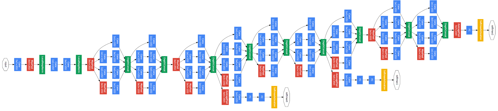
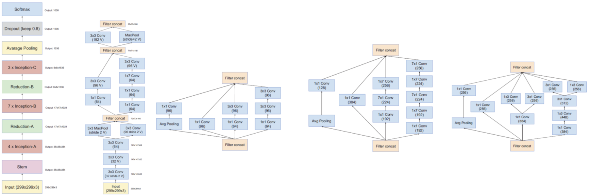
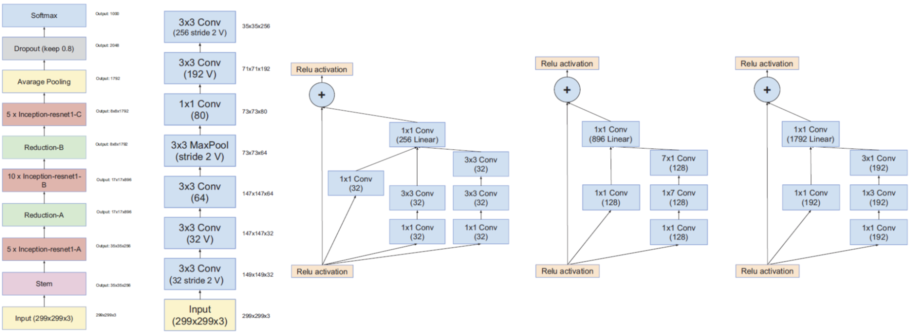

# Architectures

## [AlexNet](https://papers.nips.cc/paper/4824-imagenet-classification-with-deep-convolutional-neural-networks.pdf)

## [VGG16](https://arxiv.org/pdf/1409.1556.pdf)

16 refers to 16 layers

## [VGG19](https://arxiv.org/pdf/1409.1556.pdf)

## [YOLOv2](https://arxiv.org/pdf/1612.08242.pdf)

## [ResNet](https://arxiv.org/pdf/1512.03385.pdf)

## [Inception v1](https://arxiv.org/pdf/1409.4842v1.pdf)

also known as GoogLeNet

## [Inception v3](https://arxiv.org/pdf/1512.00567v3.pdf)

## [ResNeXt](https://arxiv.org/pdf/1611.05431.pdf)

## [Inception v4](https://arxiv.org/pdf/1602.07261.pdf)

Inception-v4: Whole Network Schema (Leftmost), Stem (2nd Left), Inception-A (Middle), Inception-B (2nd Right), Inception-C (Rightmost)

## [Inception ResNet v1](https://arxiv.org/pdf/1602.07261.pdf)

Inception-ResNet-v1: Whole Network Schema (Leftmost), Stem (2nd Left), Inception-A (Middle), Inception-B (2nd Right), Inception-C (Rightmost)

## [Inception ResNet v2](https://arxiv.org/pdf/1602.07261.pdf)

Inception-ResNet-v2: Inception-A (Leftmost), Inception-B (Middle), Inception-C (Rightmost)
