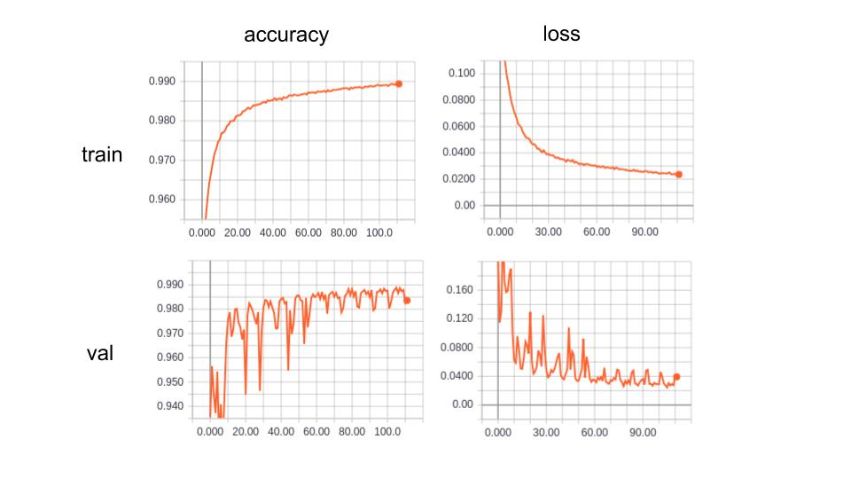
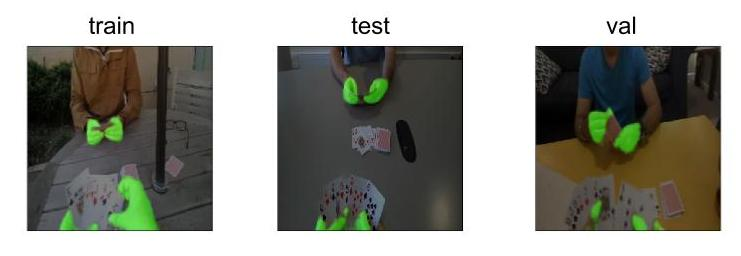
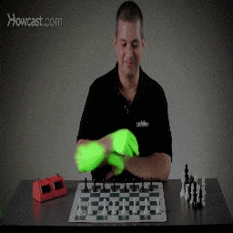
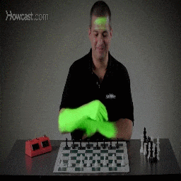
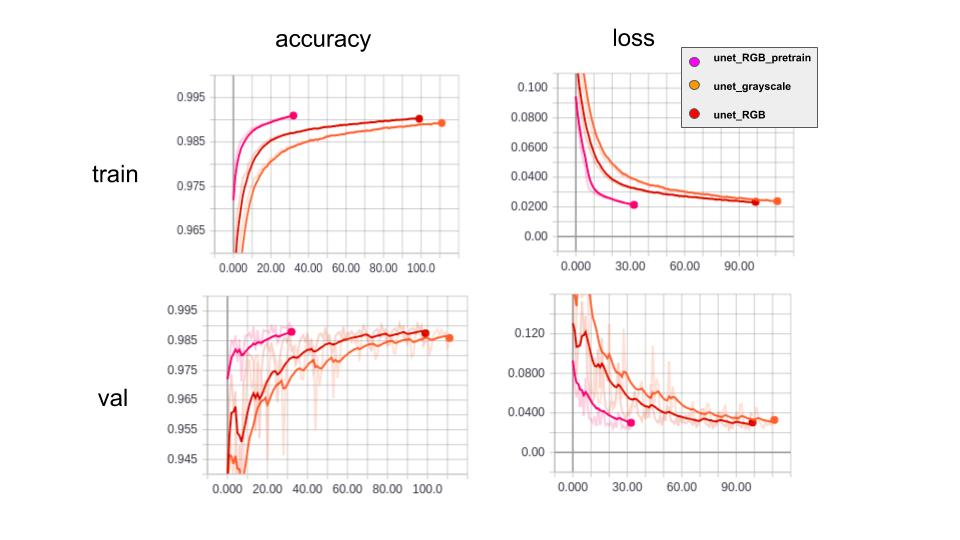

# EXPERIMENTS

Details on hand segmentation experiments.

* [Experiment 1: unet-egohand-grayscale](#experiment-1)
* [Experiment 2: unet-egohand-RGB](#experiment-2)
* [Experiment 3: unet-egohand-RGB-pretrain](#experiment-3)

## Experiment 1

__Model__: [U-Net](https://arxiv.org/pdf/1505.04597.pdf)

__Dataset__: [EgoHands](http://vision.soic.indiana.edu/projects/egohands/)

__Split ratio__: train:test:val = 36:8:4

__Input__: Grayscale image

__Target__: Binary hand mask

__Preprocessing__:
1. Convert RGB to grayscale
2. Resize to (256, 256)
3. Standardize (subtract mean, divide standard deviation)

__Augmentation__:
1. Random flip left or right
2. Random crop to (224, 224)

__Optimizer__: Adam (learning rate = 1e-4)

__Loss function__: Cross-entropy

__Epochs__: 100

### Evaluation Results

#### Training

#### Quantitative

| Data Split  |   IoU   |   F1    | Precision   |  Recall   |
|:----------: |:------: |:------: |:---------:  |:-------:  |
|    Train    | 0.8022  | 0.8872  |   0.8676    | 0.91499   |
|    Test     | 0.7190  | 0.8306  |   0.8182    |  0.8546   |
|     Val     | 0.7066  | 0.8236  |   0.8058    |  0.8500   |

#### Qualitative

  

#### Real-time processing

  
  
  

From left to right:
* [Chess](https://www.youtube.com/watch?v=gODqPoBbVgU&list=PLLALQuK1NDriznzxP5rQkQwKIrGSWRMZF)
* [Jordan Peterson](https://www.youtube.com/watch?v=jjioPqQlmG8)
* Webcam recording of me

## Experiment 2

__Model__: [U-Net](https://arxiv.org/pdf/1505.04597.pdf)

__Dataset__: [EgoHands](http://vision.soic.indiana.edu/projects/egohands/)

__Split ratio__: train:test:val = 36:8:4

__Input__: RGB image

__Target__: Binary hand mask

__Preprocessing__:
1. Resize to (256, 256)
2. Standardize (subtract mean, divide standard deviation)

__Augmentation__:
1. Random flip left or right
2. Random crop to (224, 224)

__Optimizer__: Adam (learning rate = 1e-4)

__Loss function__: Cross-entropy

__Epochs__: 100

### Evaluation Results

#### Quantitative

| Data Split  |   IoU   |   F1    | Precision   | Recall  |
|:----------: |:------: |:------: |:---------:  |:------: |
|    Train    | 0.8078  | 0.8909  |   0.8951    | 0.8937  |
|    Test     | 0.7429  | 0.8476  |   0.8410    | 0.8654  |
|     Val     | 0.6686  | 0.7847  |   0.7521    | 0.8524  |

#### Real-time processing

  
  
  

It seems that the network places heavy emphasis on colour matching.

From left to right:
* [Chess](https://www.youtube.com/watch?v=gODqPoBbVgU&list=PLLALQuK1NDriznzxP5rQkQwKIrGSWRMZF)
* [Jordan Peterson](https://www.youtube.com/watch?v=jjioPqQlmG8)
* Webcam recording of me

## Experiment 3

__Model__: [U-Net](https://arxiv.org/pdf/1505.04597.pdf) with encoder pretrained with [VGG19](https://arxiv.org/pdf/1409.1556.pdf)

__Dataset__: [EgoHands](http://vision.soic.indiana.edu/projects/egohands/)

__Split ratio__: train:test:val = 36:8:4

__Input__: RGB image

__Target__: Binary hand mask

__Preprocessing__:
1. Resize to (256, 256)
2. Standardize (subtract mean, divide standard deviation)

__Augmentation__:
1. Random flip left or right
2. Random crop to (224, 224)

__Optimizer__: Adam (learning rate = 1e-4)

__Loss function__: Cross-entropy

__Epochs__: 100

### Evaluation Results

#### Training

Transfer learning seems to improves training curves.

#### Quantitative

| Data Split  |   IoU   |   F1    | Precision   | Recall  |
|:----------: |:------: |:------: |:---------:  |:------: |
|    Train    | 0.7971  | 0.8846  |   0.8581    | 0.9189  |
|    Test     | 0.7118  | 0.8269  |   0.7828    | 0.8894  |
|     Val     | 0.7106  | 0.8252  |   0.7979    | 0.8621  |

